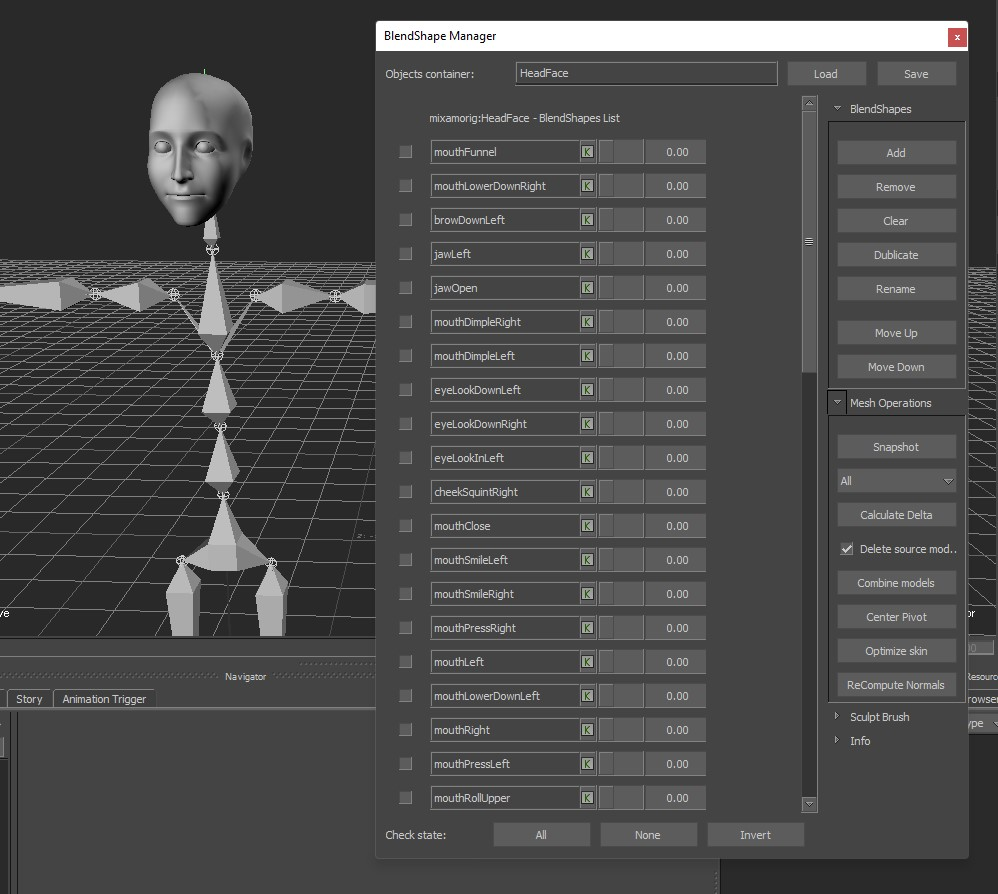
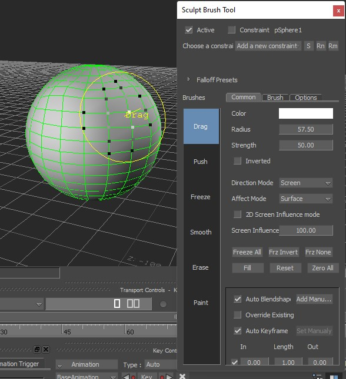

# Blendshape Toolkit

Tools for creating corrective blendshapes for Models.

blendshapes tool - manage and animate your mesh blendshapes list

Sculpting brush - modify your mesh

Internaly:
- make snapshot, calculate delta, combine meshes and some pro features
- deformer constraint - helper constraint to sculpt deformated meshes in real-time

## LOG

06.05.2016
 * fix retrieve on file merge in the deformer constraint

08.02.2016
 * fix Combine Models operation

14.05.2015
 + added support for the wacom pen pressure (using wintab32.dll)

29.01.2014
 + deformer constraint: add single frame caching and plotting

26.01.2014
 * make constraint addblendshape thread safe
 * fix button images
 * fix constraint blendshape weight calculation

20.01.2014
 + test with exclusive mode
 + store freeze vertices states
 + add deformer constraint UI interface
 + addmanualblendshape method exposed in python, key shortcut

19.01.2014
 + seems i delete a key frame but the value stays 100
 + WHEN i Delete the constraint it wont creat a new one 
   unless i restart
 +shape deformers cont go into the negative values ? 

13.11.2014
 + deform constraint works!

10.11.2014
 * fix direct normal mapping indexing
 + add invert normals operation

28.08.2014
 + first workable version of deform sculpting

22.08.2014
 + ui for real-time deformer constraint
 * deformer constraint in progresss

07.04.2014
	* fix brush weights calculations with scale in models

31.03.2014
	+ add recompute normals operation
	+ add function to center model pivot
	+ add option to delete source models for combine operation
	+ in 2d mode change 2d radius by right mouse button

26.03.2014
 + add 2d influence mode
 * fix perspective drag influence
 * fix combine meshes operation on complex scenes

25.03.2014
 * fix perspective drag influence

24.03.2014
 + copy shader settings to the snapshot
 + make multiple snapshots

22.03.2014
 + combine meshes functionality

12.03.2014
 * fix blendshape Add function
 + add version information and string resources to plugin dll

05.03.2014
 + keep checkboxes after move up/down operation

28.02.2014
 * fix multi models blendshape UI operations
 * assign unique snapshot name

27.02.2014
 * fix bug random brush tool loading and filter for model only with geometry
 + save\load\merge blendshapes for models (open xml format)

26.02.2014
 + freeze or selection brush

25.02.2014
 + blendshapes list - move up / move down

24.02.2014
 + combined meshes with skin cluster
 + add optimization skin function and button for it in UI

22.02.2014
!! + debug snapshot texturing bug, FBX SDK (add textures and materials)

20.02.2014
+ debug 50-70 blendshapes
+ bug with making a blendshape from two simple sphere snapshot (difference in pivot points)
+ fix bug (sculpt different meshes)

18.02.2014
+ brush direction - Screen, First Normal, AverageNormal, X, Y, Z
+ check main model container
+ check wacom device deleting in the scene

17.02.2014
+ 2d text feedback (current brush and inverted strength state)
+ make the snapshot keep the textures
+ button for launch a brush tool
+ add brush and falloff images for containers
+ make a work of brush tool Active option
+ dublicate and rename buttons functionality
+ add options for local strength and radius for each brush

14.02.2014
+ fix smooth and erase brush
+ calculate delta without active blendshapes
+ pen pressure will be nice - connect Wacom Tablet Device and grab Region Value

13.02.2014
 + remove button is not working

10.02.2014
 * fix calculate delta algorithm, prepare first beta version for massive testing

19.01.2014
 + add surface mode implementation

18.01.2014
 * fix motion notify algorithm in manipulator
 * fix polygon casting under cursor for surface mode

17.01.2014
 + support making corrective blendshapes for dynamic models

15.01.2014
 today was first demo with sculpt on sphere and adding blendshape
 + smooth brush
 + erase brush
 * correct drag brush
 + smooth, hard, point falloff
 + add blendshape procedure

14.01.2014
 + undo/redo action
 + view plane
 + start new brushes

13.01.2014
 + add brush manager, first brush and falloff

11.01.2014
 + first iteration for manipulator and layout

10.01.2014
 + snapshot geometry
 + calculate delta