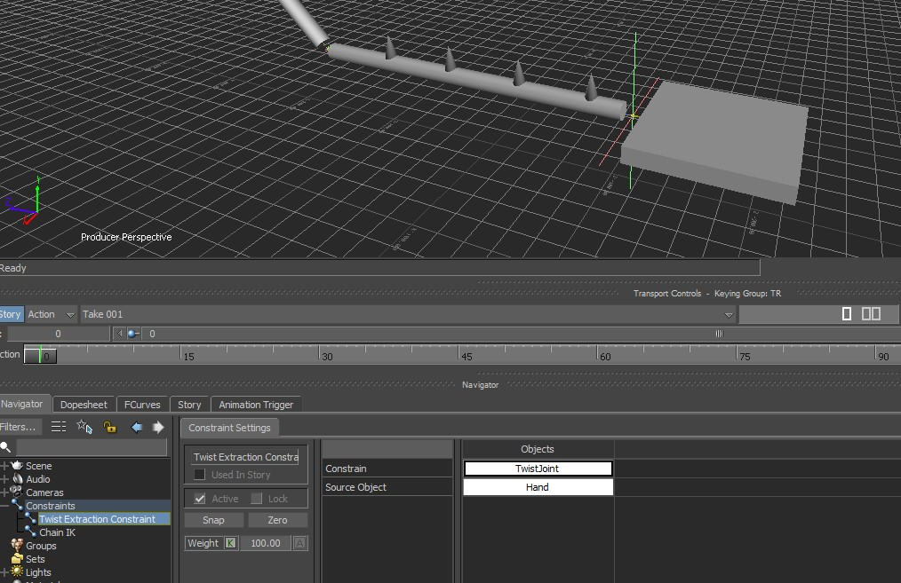

# Twist Extraction Constraint

 A constraint to extract a rotation along a given local axis from a full 3 dimentional rotation. 

 A similar technique is used for roll joints on a humanIK, where on arms, hands, legs rotations along the joint local axis are destributed into roll joints rotations and improve the quality of skinned meshes

Test scene - twistExtraction

