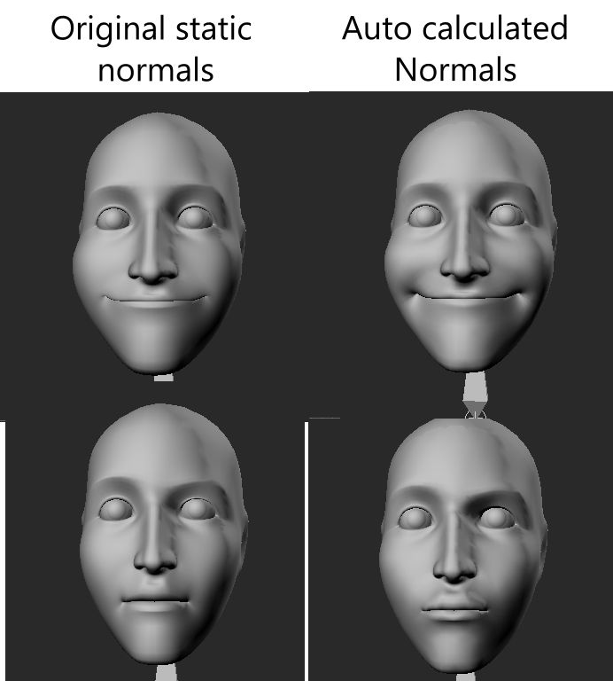
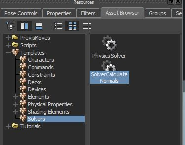
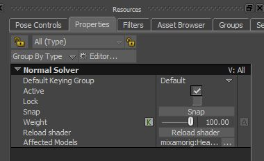

# Solver Auto Calculate Normals

 MotionBuilder loads model with vertex normal information used for lighting. The quality issue comes when you deform such mesh with a blendshape or skin binding. The MotionBuilder deforms only vertex position, but not normals. Because of that a deformation that comes from blendshapes or skinning, will not be reflected well on a shape lighting. The solver helps to recalculate normals on fly and improve the lighting experience on a deformed meshes.

 The solver does an auto normals recalculation for connected models.
 It takes a model tesselated mesh which is stored on gpu vertex buffers, then run compute shaders to recalculate and replace normals data. 

 Calculations are fully on gpu, not complex for modern cards, so the solver should not impact your scene performance in general.
 
 It doesn't take in a count any smoothing group or hard edges threshold information and that's why it could be not a good fit for some models. If your model has a nice uniform mesh with soft normals, that should work fine.

### How To Use

- Locate a solver in the assets browser in solvers category
  
  
- Add solver into the scene
- Assign models to the solver by using a model context menu or solver Affected Models property list.

### Test Scenes

[FBX Scene with Deformable mesh and the solver](https://github.com/Neill3d/OpenMoBu/blob/master/MB_Scenes/solver_CalculateNormals.fbx)

### Videos

- [first release](https://youtu.be/QYUpd1u6O_o?si=WzmfQbCdII8WR1oB)
- [first release WIP](https://youtu.be/YFLuMV-uGR8?si=pcvfAaf7Vm51x6vB)
