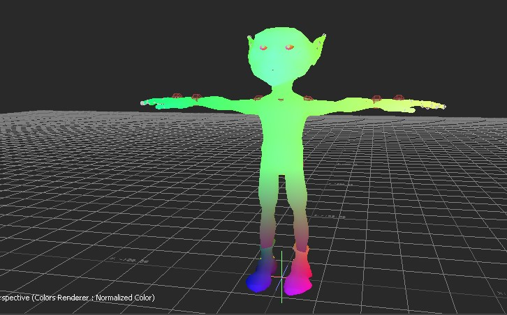

# OpenMoBu documentation

Collection of scripts and plugins for Autodesk MotionBuilder

## Introduction Videos

[Stream Video Part 1](https://www.youtube.com/live/sgzunIbNcp4?si=kTXzdfnZ3FnkiIdv)

## Pages

 Articles on different topics

[How To Install](HowToInstall.md)

[How To Compile/Build](HowToCompile.md)

[Script Device](ScriptDevice.md)

## Relation Constraint Boxes

 Those plugins are extended functionality of relation constraint which is a form of visual programming with node system and connections between nodes. The plugins add new nodes to the constraint.

- Comet's PoseReader Box (rigging for correction joints)
- Look Rotation Box (aim constraint calculations in a form of relation constraint box)
- PoseTransform Box (extract transform and blend from stored poses)
- RayIntersect Box (calculate an intersection point between ray and a mesh) 
- RBF Box (Radial Basis Function node, rigging for correction joints)
- Sphere Coords Box (convert an Euler rotation into sphere coords)
- Spring Box (spring dynamics, secondary motion)
- Quaternion Math boxes

[Read More...](Plugins/relationBoxes.md)

## Constraint Plugins

A set of plugins that constains source object / objects with a destination object / objects with a defined logic
 For example, parent/child, aim, surface attachment, etc.
 Constraint computed result has a priority over the animation keyframe data.

- [Attachment Constraint](Plugins/attachmentConstraint.md)
- [Driven Property Constraint](Plugins/drivenPropertyConstraint.md)
- [Twist Extraction Constraint](Plugins/constraint_twistExtraction.md)

## Devices

 A plugin which handle some external Input/Output with real-time data flow and nodes constraints

### FaceCap Device

A device plugin for live streaming via OSC from FaceCap iPhone App
For more information, please visit [FaceCap official website](https://bannaflak.com/face-cap/index.html)

## View Manipulators

 A plugin which hook the user input operations with the viewport in order to perform some action in the scene like transforming objects by dragging manipulator handle with the mouse input

[Lock Camera Manipulator](Plugins/manipulator_lockCamera.md)

## Graphics

 Shading, fx, geometry preparation for rendering

### Post Processing Filters

 A special user object, that helps to add post process filters on top of your camera view.

[Read More...](Plugins/PostProcessingEffects.md)

### Super Dynamic Lighting Shader

 This is an advance version of Dynamic Lighting Shader with features like vertex displacement, specular map, Matcap shading, etc.

[Read More...](Plugins/shader_superDynamicLighting.md)

### Renderer Colors

 A special renderer that could render your scene with color ids or normalized colors

### Texture

- Texture Advanced Blend

 A texture object to mix two images with a wide range of composite modes and optional masking the second texture target

- Texture Parametric Blend

 A texture object to support atlas packed image or in other words a texture object for sprite texture animation. The atlas image is a collection of images that are packed inside one bigger images side by side. It's quite often used in game industry for fx, as it gives some performance gain to change a next frame by offsetting uv coordinates instead of reading a separate image.

[Read More...](Plugins/textures.md)

### Calculate Normals Solver

 A solver to recalculate mesh normals on fly during rendering. That helps to better visualize deformations from blendshape activation or by skinned skeleton transform.

[Read More...](Plugins/solverCalculateNormals.md)

## References Manager and FBX Extension

 This is a set of 2 plugins, one command line console application and python scripts in order to stabilize and extend the functionality of referenced models (support for shaders) in motionbuilder scene.

 Reference Manager depends on shadingGraph cmd application which extracts shaders graph xml from fbx files.

 FBX Extension is a plugin that hooks the fbx file import on motionbuilder scene loading and fixes a bug with locked reference model on missing reference file.

[Read More...](Plugins/ReferencesManager.md)

## Misc

 Tools, custom objects in the scene

### BlendShape Toolkit

- Blendshape manager - to manage the given model blendshapes, plus additional functionality to add/remove/duplicate, save/load from file, do a snapshot

- Blenshape Sculpt - use brushes to create or modify a blendshape. it can be useful for making correction blendshapes on fly, as you can sculpt on top of current deformed mesh and it will generate a correspondent correction blendshape

[Read More...](Plugins/blendshapeToolkit.md)

### Manager To Link Group Visibility with a Camera

 A special manager that could help to control a group visibility with a camera activation. When you switch between cameras in the viewport, the attached groups will change their visibility.

[Read More...](Plugins/cameraLinksGroupVisibility.md)

### Optical Volume Calculator

 The custom model that helps to calculate a unit score of a volume coverage for the optical system. In order to run the solver, you have to immitate the capturing space by placing cameras the same way how you are going to place them in the real room with a correct defined FOV and aspect ratio.

[Read More...](Plugins/opticalVolumeCalculator.md)

## About the project

Sergei (Neill3d) Solokhin

Special thanks to Les Androids Associes.

[Support the project](https://ko-fi.com/neill3d)
