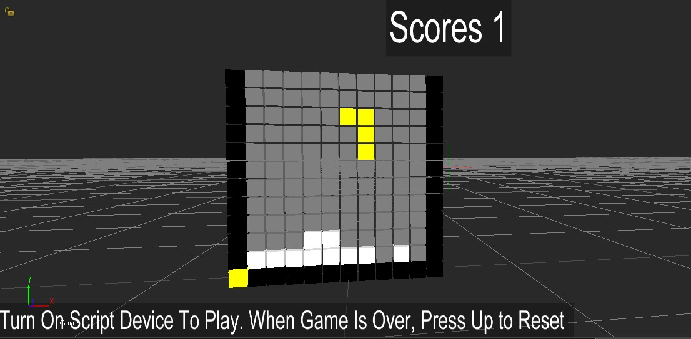

# Script Device

The powerful MotionBuilder Python Script device has long existed, but has often been overlooked in learning materials, tutorials, and documentation.

The implementation of my Tetris game didn't require any third-party scripts or plugins to run on my system - everything was done with the help of the tools available out of the box.

The Python Script device is a device that can run Python code when triggered.

If triggered, for example at 30 frames per second, the Python Script device will provide almost real-time evaluation of custom logic.

Even though there may be some lag in the motion of the cubes on my PC, this doesn't slow down the performance of MotionBuilder's evaluation threads. In fact, it only takes a small amount of resources away from idle threads, allowing for complex scenes, characters, and stories to be worked with in a responsive environment.

## Proc:

The Python Script device, when used properly, can provide custom logic, extended mathematics, and other capabilities that are not available in the Relation Constraint, or that would take an excessive amount of time to set up with macros and per-object connections. In some cases, using the Python Script device plugin can provide a more performant evaluation when working with multiple objects, compared to using the Relation Constraint. That could be for cases when relation constraint has to setup a lot of input and output nodes that require of making additional animation nodes for live input and recording. In case of python script, that is not needed, we take control over the model transform directly

## Cons:

A need to find workaround for baking and render (offline render). As evaluation is fully real-time idle thread based, it's not a part of plot or render logic and the python code will not be triggers over there. The workaround is implemented in the post process plugin which has a feature to trigger everyframe any available python script device.

## How To Setup

When developing logic, I use a Python editor as a playground to experiment with code. Once I'm satisfied, I copy and paste it into the Python Script device to evaluate in real-time. In this case, I wanted to create two cubes, and it's important to remember that the code is running under the same Python context. This means that variables and functions created will be available in the context, which I used to perform optimizations at the end.

We will also need a Relation Constraint, which can help to trigger the Python Script device, as well as store system or local time in the object property for our run-time code to have a sense of time for our math logic. While it is possible to obtain these values from the Python code itself, using a Relation Constraint is a convenient way to do this.

## Example



To start with, here's a simple example. For a more complex example, please refer to the Tetris game, which is available on GitHub in the openmobu repository. [Here is a link to download](../../MB\_Scenes/Tetris.fbx)

First, I'll demonstrate how the Python Script device evaluation looks. Then, for those interested, I'll show how to create a similar setup from scratch and start using the Python Script device for their own needs.

Let's create two cubes in the scene and locate them via the Python code.

## Some tricks

As previously mentioned, since the code is running in the same context, one optimization we can do in order to avoid calling FBFindModelByLabelName on every tick, and instead do it just once during initialization.

The Python Script device doesn't have a specific initialization block, but we can use the power of Python exceptions to achieve this. The trick is to run the code in a try block, and if the variables are not accessible and an exception is thrown, this means it's the first time the code is running in the context and the variables need to be initialized.

```
try:

<every tick code>

except (NameError,), e:

<initialization code>
```
