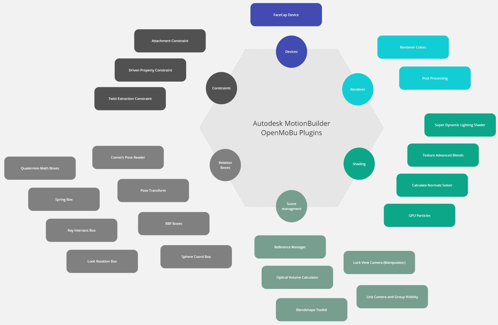

---
layout:
  title:
    visible: true
  description:
    visible: true
  tableOfContents:
    visible: true
  outline:
    visible: true
  pagination:
    visible: false
---

# Plugins Overview

<figure><figcaption></figcaption></figure>

## Relation Constraint Boxes

Those plugins are extended functionality of relation constraint which is a form of visual programming with node system and connections between nodes. The plugins add new nodes to the constraint.

* Comet's PoseReader Box (rigging for correction joints)
* Look Rotation Box (aim constraint calculations in a form of relation constraint box)
* PoseTransform Box (extract transform and blend from stored poses)
* RayIntersect Box (calculate an intersection point between ray and a mesh)
* RBF Box (Radial Basis Function node, rigging for correction joints)
* Sphere Coords Box (convert an Euler rotation into sphere coords)
* Spring Box (spring dynamics, secondary motion)
* Quaternion Math boxes

[Read More...](relationboxes.md)

## Constraint Plugins

A set of plugins that constains source object(s) with a destination object(s) with a defined logic. For example, parent/child, aim, surface attachment, etc. Constraints are evaluated on top of keyframe animation data and has a higher priority.

* [Attachment Constraint](attachmentconstraint.md)
* [Driven Property Constraint](drivenpropertyconstraint.md)
* [Twist Extraction Constraint](constraint\_twistextraction.md)

## Devices

A plugin which handle some external Input/Output with real-time data flow and nodes constraints

### FaceCap Device

A device plugin for live streaming via OSC from FaceCap iPhone App For more information, please visit [FaceCap official website](https://bannaflak.com/face-cap/index.html)

## View Manipulators

A plugin which hook the user input operations with the viewport in order to perform some action in the scene like transforming objects by dragging manipulator handle with the mouse input

[Lock Camera Manipulator](manipulator\_lockcamera.md)

## Graphics

Shading, fx, geometry preparation for rendering

### Post Processing Filters

A special user object, that helps to add post process filters on top of your camera view.

[Read More...](postprocessingeffects.md)

### Super Dynamic Lighting Shader

This is an advance version of Dynamic Lighting Shader with features like vertex displacement, specular map, Matcap shading, etc.

[Read More...](shader\_superdynamiclighting.md)

### Renderer Colors

A special renderer that could render your scene with color ids or normalized colors 

### Texture

* Texture Advanced Blend

A texture object to mix two images with a wide range of composite modes and optional masking the second texture target

* Texture Parametric Blend

A texture object that supports an atlas-packed image, or in other words, a texture object for sprite texture animation. The atlas image is a collection of smaller images packed side by side within a larger image. This technique is commonly used in the game industry for effects, as it provides a performance boost by changing to the next frame by offsetting UV coordinates instead of loading a separate image.

[Read More...](textures.md)

### Calculate Normals Solver

A solver that recalculates mesh normals on the fly during rendering. This helps to better visualize deformations caused by blendshape activation or transformations from a skinned skeleton.

[Read More...](solvercalculatenormals.md)

### GPU Particles

Particle system that is evaluated on gpu

[Read More...](gpuparticlesshader.md)

## References Manager and FBX Extension

This is a set of 2 plugins, one command line console application and python scripts in order to stabilize and extend the functionality of referenced models (support for shaders) in motionbuilder scene.

Reference Manager depends on shadingGraph cmd application which extracts shaders graph xml from fbx files.

FBX Extension is a plugin that hooks the fbx file import on motionbuilder scene loading and fixes a bug with locked reference model on missing reference file.

[Read More...](referencesmanager.md)

## Misc

Tools, custom objects in the scene

### BlendShape Toolkit

* Blendshape manager - to manage the given model blendshapes, plus additional functionality to add/remove/duplicate, save/load from file, do a snapshot
* Blenshape Sculpt - use brushes to create or modify a blendshape. it can be useful for making correction blendshapes on fly, as you can sculpt on top of current deformed mesh and it will generate a correspondent correction blendshape

[Read More...](blendshapetoolkit.md)

### Manager To Link Group Visibility with a Camera

A special manager that helps control group visibility based on camera activation. When you switch between cameras in the viewport, the visibility of the attached groups will automatically change.

[Read More...](cameralinksgroupvisibility.md)

### Optical Volume Calculator

A custom model that calculates the unit score of volume coverage for an optical system. To run the solver, you need to simulate the capture space by positioning the cameras as you would in the real room, with the correct field of view (FOV) and aspect ratio.

[Read More...](opticalvolumecalculator.md)
