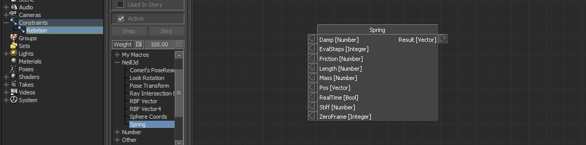

# Relation Constraint Boxes

## Comet's PoseReader relation box

Rigging for correction joints

Category - OpenMobu

A relation constraint box based on Comet's PoseReader plugin for Autodesk Maya. The idea is to calculate the activation of factor when a given transform rotatin is inside a given cone limits.

Could be very useful for rigging, when you want to operate with correction joints where activation is connected to a joint certain orientation. For instance, to correct a shoulder raise up level when arm is looking up.

There is a test scene to demonstrate a rig setup on the left shoulder of a skeleton.

[Example scene](../../../MB\_Scenes/relationBox\_PoseReader.fbx)

[Video on Youtube](https://youtu.be/kSSu6DMcXNI?si=dn8zvbA9cIwPQVcN)

## PoseTransform Box

extract transform and blend from stored poses

Category - OpenMobu

[Sample scene - relationBox\_PoseTransform.fbx](../../../MB\_Scenes/relationBox\_PoseTransform.fbx)

## Look Rotation Box

calculate a rotation to look at a given target point

Category - OpenMobu

[Sample scene - relationBox\_LookRotation.fbx](../../../MB\_Scenes/relationBox\_LookRotation.fbx)

## RayIntersect Box

calculate an intersection point between ray and a mesh

Category - OpenMobu

[Sample scene - relationBox\_RayIntersect.fbx](../../../MB\_Scenes/relationBox\_RayIntersect.fbx)

## Quaternion math boxes

Boxes Category - Quaternion

List of boxes:

* Axis Rotation
* Euler To Quaternion
* Interpolate
* Invert
* Look Rotation
* Mult
* Normalize
* Quaternion To Euler
* RotateBy

[Sample scene - relationBox\_QuaternionMath.fbx](../../../MB\_Scenes/relationBox\_QuaternionMath.fbx)

## RBF Box

Radial Basis Function node, rigging for correction joints

Interpole input between n-dimentional targets

Category - OpenMobu

Boxes:

* RBFVector
* RBFVector 4

[Sample scene - relationBox\_RBF.fbx](../../../MB\_Scenes/relationBox\_RBF.fbx)

## Sphere Coords Box

Convert Euler Rotation into Sphere Coords. In that case we could avoid gimbal lock effect on rotation and do a relation based on a polar coords on a sphere surface. Could be a nice suit for rigging correction joints.

Category - OpenMobu

[Sample scene - relationBox\_SphereCoords.fbx](../../../MB\_Scenes/relationBox\_SphereCoords.fbx)

[Sample scene - relationBox\_SphereCoords\_ExtractRotationXZ.fbx](../../../MB\_Scenes/relationBox\_SphereCoords\_ExtractRotationXZ.fbx)

## Spring Box

spring dynamics, secondary motion

A box for relation constraint 

Spring box math based on fundamental formule F = -kx

[A short demo video on Youtube](http://youtu.be/rAToQEmg\_LY)

[Sample scene - relationBox\_Spring.fbx](../../../MB\_Scenes/relationBox\_Spring.fbx)

[Sample scene - relationBox\_SpringAndCamera.fbx](../../../MB\_Scenes/relationBox\_SpringAndCamera.fbx)

| Parameter  | Description                                                                                                                                                                                                                                                                     | Default Value |
| ---------- | ------------------------------------------------------------------------------------------------------------------------------------------------------------------------------------------------------------------------------------------------------------------------------- | ------------- |
| Stiff      | stiffness of the springs (the higher the value, the more rigid) Hardness is the reaction and the effect of the spring from which she draws a point in the original position.                                                                                                    | 0.1           |
| Damp       | the size of fading fluctuations spring (the more, the less hesitation commit spring) The essence of this parameter under a big question, in practice, it gives some the wrong result, so sometimes fading fluctuations can be regarded as a constant value of 0.10 for example. | 0.0           |
| Length     | the length of the spring (should be set to 0) A value of zero reference position is the point of going, otherwise the spring will be busy trying to position a specified distance from moving                                                                                   | 0.0           |
| Mass       | the mass. The more weight the more difficult it is to move the spring with a space or vice versa to return it to its original position.                                                                                                                                         | 1.0           |
| Friction   | force of resistance that allows “stifle” the dynamics of the spring and return it to its original position. The higher the number the less the effect of spring ”                                                                                                               | 0.1           |
| EvalSteps  | number of spring evaluation substeps per second                                                                                                                                                                                                                                 | 30.0          |
| RealTime   | checkbox to specify spring evaluation time. When checkbox is on, spring uses system time and play in realtime. When it’s off, spring uses player control local time from time slider (this is for plotting and animation playback).                                             | on (1.0)      |
| Zero Frame | frame on which we reset our simulation (for non realtime evaluation). This is when we rewind our animation to the very begining and want to start simulation from that “zero” point                                                                                             | 0 (frame 0)   |
| Pos        | input position                                                                                                                                                                                                                                                                  |               |
| Result     | output position                                                                                                                                                                                                                                                                 |               |
